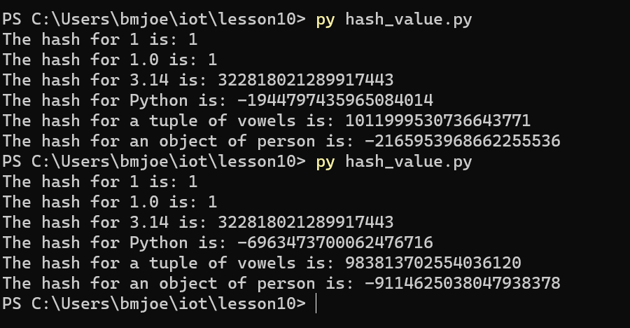
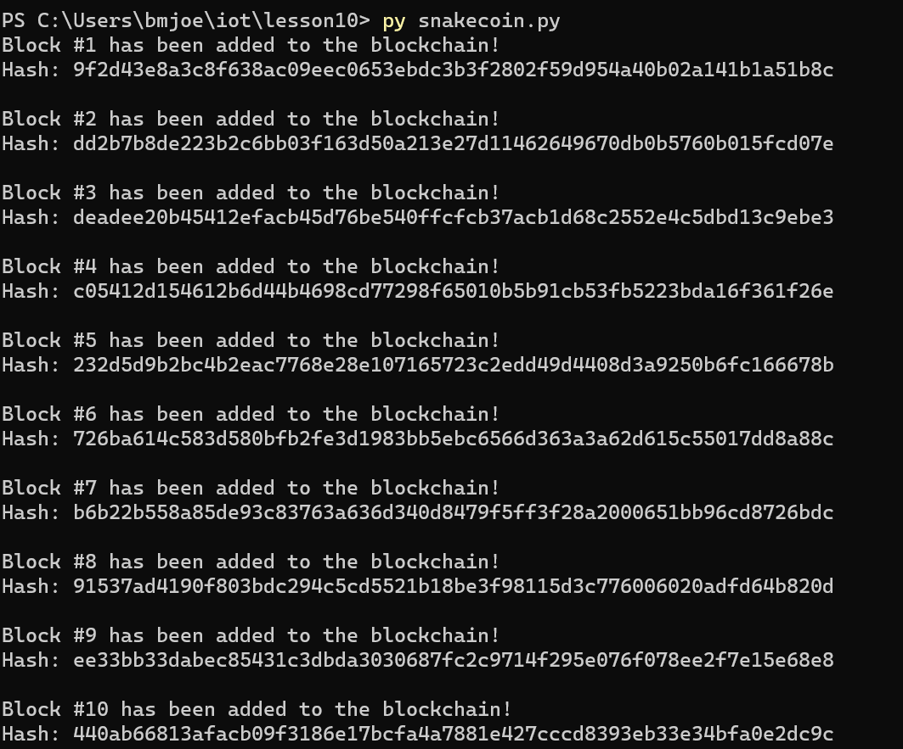
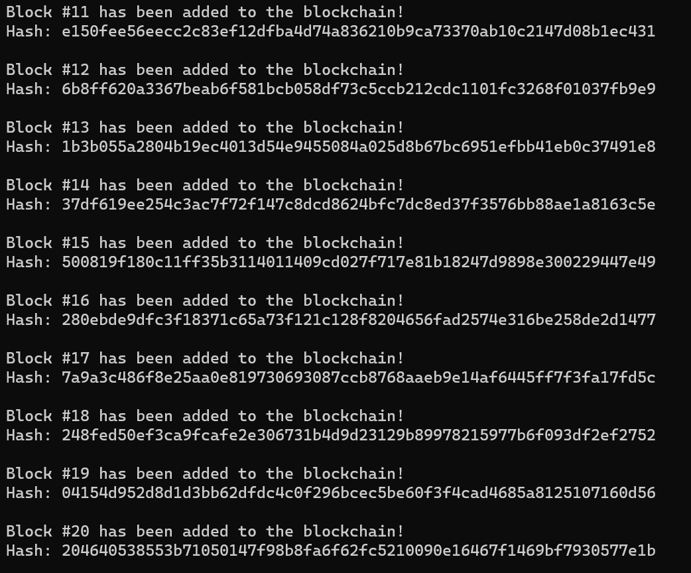
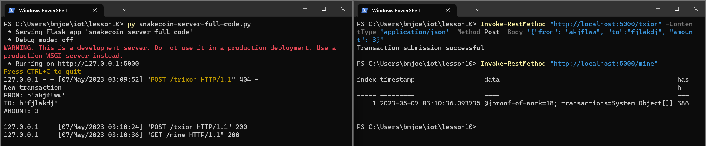
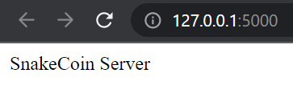
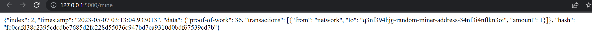
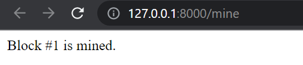
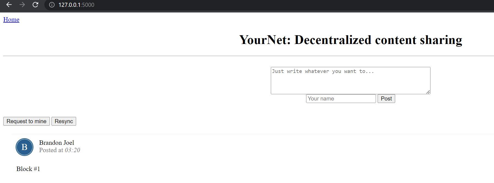

# Results

## Hash Value

## SnakeCoin

## SnakeCoin Server

### Creating transaction from terminal

### SnakeCoin Server Page

### SnakeCoin Mining Page

## YourNet

### Requesting to mine

### Confirming block is mined

### Resyncing original page to see block mined

