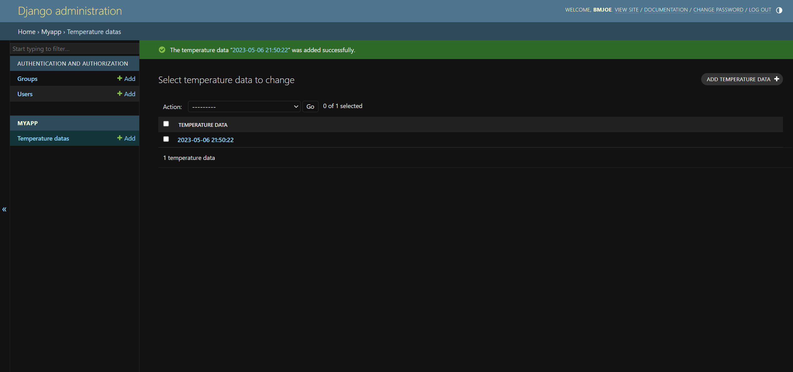
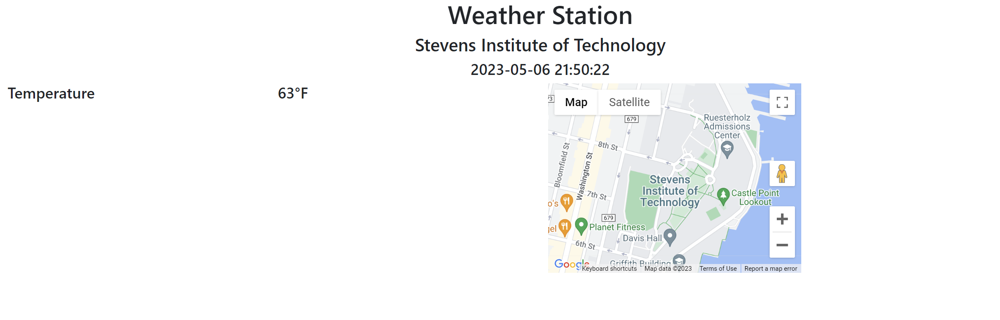
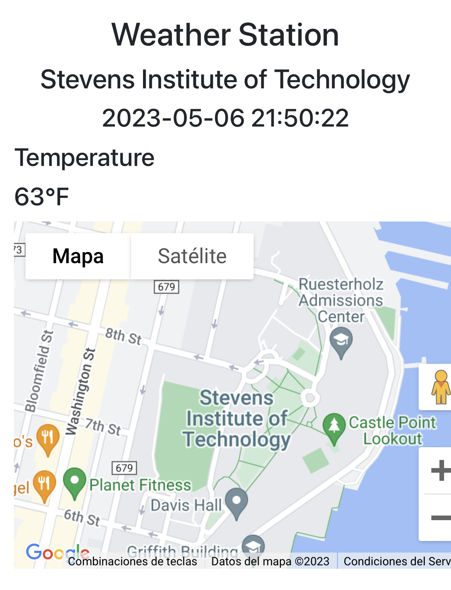
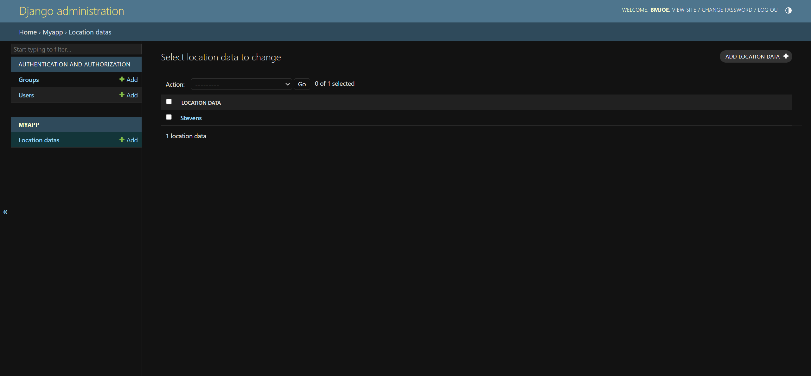
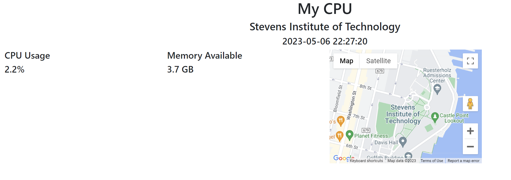

# Results

## Django

### Temperature data entered in admin page

### Temperature data viewed locally

### Temperature data viewed on another device

### CPU data entered in admin page

### CPU data viewed locally

### CPU data viewed on another device

## Flask

### hello_world

