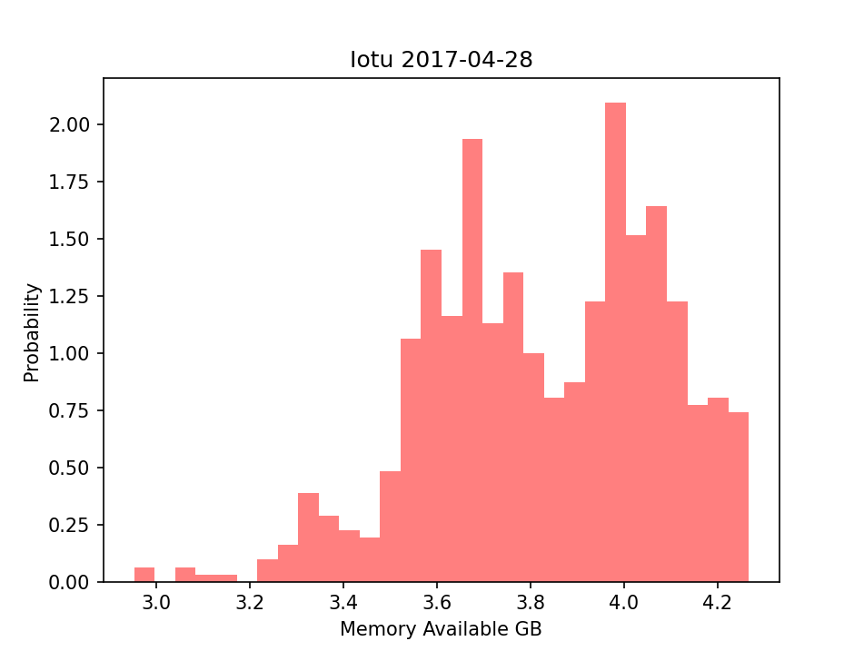

# Results

## plt_final.py

### Time Series of CPU Usage and Memory Available

### Histogram of CPU Usage

### Histogram of Memory Available

### Horizontal Box Plot of CPU Usage

### Vertical Box Plot of Memory Available

### Scatter Plot of Memory Available vs. CPU Usage with a linear regression line

## plt_cv2.py

### Cross-Validation Prediction with Memory Available as target

