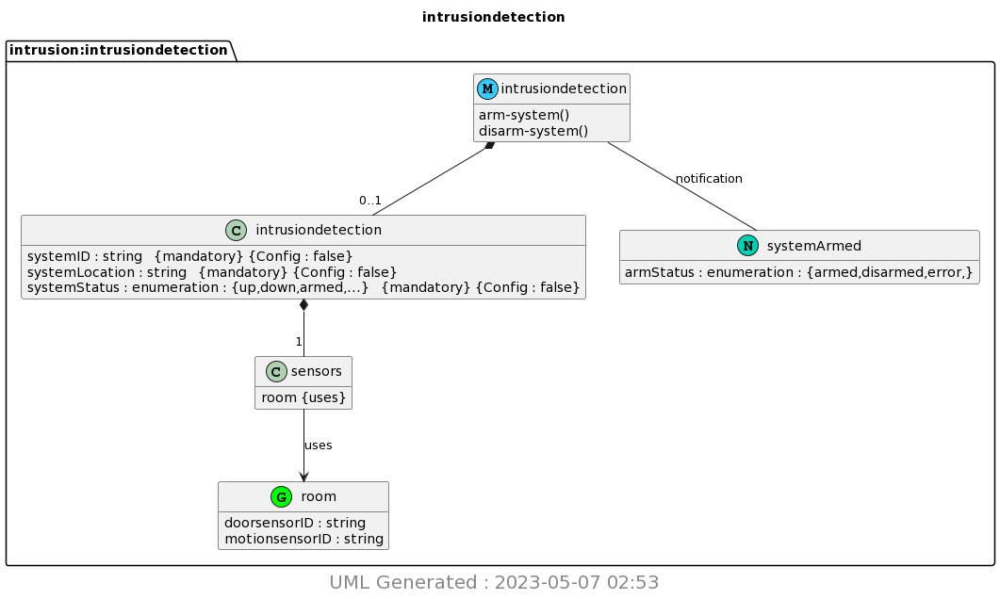

# Lab 9 - YANG

## Instructions

1. Study the GitHub repository Lesson 9
2. Install pyang and PlantUML
3. copy ~/iot/lesson9/intrusiondetection.yang to ~/demo
4. Run pyang to generate intrusiondetection.yin and intrusiondetection.uml
5. Run PlantUML to generate intrusiondetection.png

## Results

### Intrusion Detection

